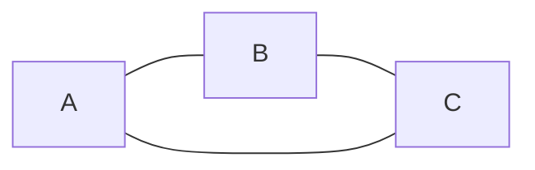
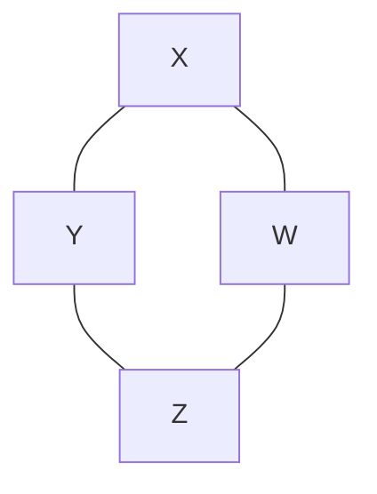

# Isomorphism

Prove that if two graphs $A$ and $B$ do not have the same number of nodes, they cannot be isomorphic. I have started with the formal definition of isomorphism
below. Add your answer to this markdown file. [This page](https://docs.github.com/en/get-started/writing-on-github/working-with-advanced-formatting/writing-mathematical-expressions) might help with the notation for mathematical expressions.

$G_1=(V_1 , E_1)$ is isomorphic to $G_2 = (V_2, E_2)$ if there exists a
one-to-one and onto function (bijection) $f: V_1 \rightarrow V_2$ such that $(u,v)
\in E_1$ iff $(f(u),f(v)) \in E_2$.

## Answer

Consider the following two graphs

$G_{1} = $

$G_{2} = $

As we can see, $G_{1}$ has one less node than $G_{2}$, and as such we can use them as arbitrary examples for this proof. Keep in mind that despite the fact that I am providing example graphs, I will only use generalized reasoning in the subsequent portions of this proof. I have provided the examples solely to aid the reader(s) in visualizing the points I bring up.

By the definition of bijective above, we know that these two graphs **must** satisfy both the definition's of surjection *and* injection in order to be isomorphic to each other. Let us determine whether such a mapping could possibly exist between *(any arbitrary)* $G_{1}$ and $G_{2}$.

Suppose that $m$ is a mapping between $G_{1}$ and $G_{2}$, that is: $m : G_{1} \mapsto G_{2}$. While $m$ can very easily map every node from $G_{1}$ **onto** $G_{2}$, $G_{2}$ will still have that additional node that cannot possibly be mapped to a *unique* node in $G_{1}$. Thus, we run into a **generalized** issue that when the number of nodes are not equal in any two graphs, the onto and one-to-one properties become mutually exclusive for **any** mapping between them.

The mapping(s) will always be capable of satisfying the surjective property, but when the number of nodes are unequal between two graphs, satisfying the injective property becomes impossible, and without injectivity we can never satisfy bijectivity.
